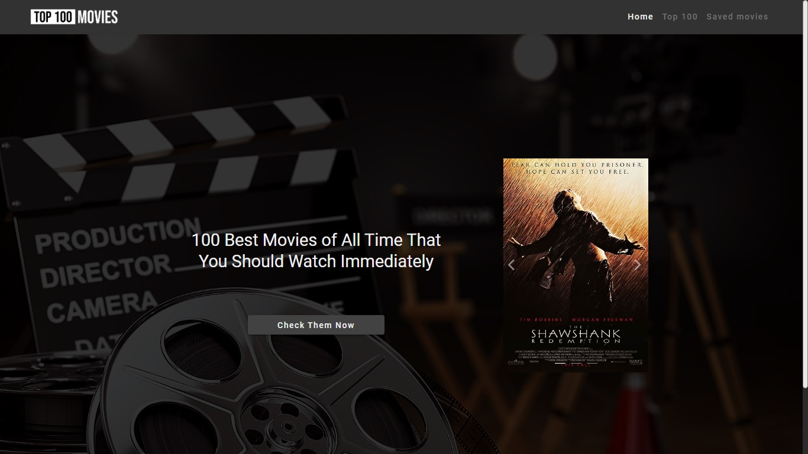

# Top 100 Movies - Aplicación Angular de las Mejores Películas

Esta es una Single Page Application (SPA) construida utilizando Angular 16 que brinda acceso a una selección de las 100 mejores películas según la clasificación de IMDb. Esta aplicación permite explorar, filtrar y obtener detalles completos sobre estas películas de renombre.

## Características Destacadas

Aquí un vistazo visual a las funciones más destacadas que ofrece la aplicación:

**Página de Inicio:**


**Lista de Películas:**


**Potentes Filtros:**


**Detalles de Película:**


**Guardar para Más Tarde:**


## Cómo Iniciar la Aplicación en tu Entorno Local

Si deseas explorar la aplicación en tu propio entorno, sigue estos sencillos pasos:

1. Instala las dependencias de la aplicación utilizando npm (Node Package Manager):
  ```bash
    npm install
  ```

2. Inicia la aplicación en modo de desarrollo:
  ```bash
    npm start
  ```

3. Abre tu navegador web y navega a http://localhost:4200 para comenzar a disfrutar de la aplicación.
